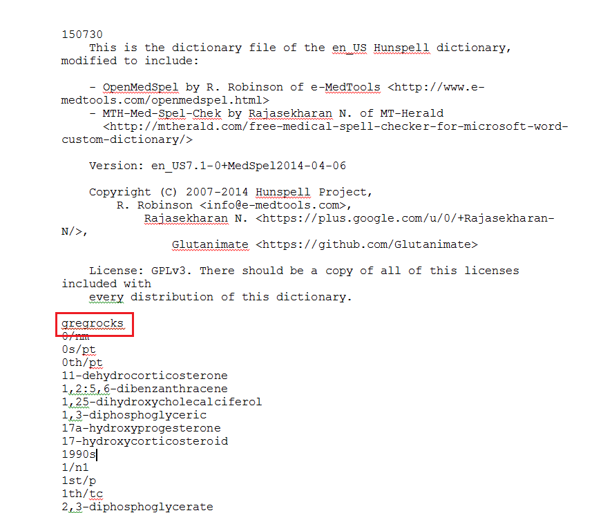

## Introduction

A large amount of data that is available to CHART data scientists comes in the form of raw text data. Common examples include: admission notes, post-operative notes, nursing notes, and discharge notes. These notes offer a lot of information that doesn't usually appear in structured Electronic Medical Records (EHR) data. However, since these notes are commonly typed into a text box, they will frequently contain spelling mistakes. To take full advantage of the information in the notes, correcting misspelled words is an important step of the data preprocessing. The following blog will demonstrate how to correct misspelled words using the R programming language. We will explore the popular hunspell package, and show how to add custom dictionaries to deal with medical data. 

The code for the blog post can be found in the following [github repository](https://github.com/LKS-CHART/correct_misspelled_words_blog). 


## The Hunspell Package

The [hunspell](https://cran.r-project.org/web/packages/hunspell/vignettes/intro.html) package is an extension of R to work with Hunspell, the spell checker used by Libre office and Rstudio among others. 

Spell checkers work by: 

1) Identifying misspelled words (i.e. words that aren't contained in the dictionary being used)    
2) Suggesting replacement words.   


The code below shows the basic usage of the hunspell package

```{r, echo=T, message=F, warning=F}
library(tidyverse)
library(hunspell)

words <- c('Sunday', 'walking', 'compleetly', 'happy', 'diferent', 'soape',
           'equal', 'absolootely')

# Check for correct spelling

spell_check <- hunspell_check(words)
spell_check


# Suggest replacement words

hunspell_suggest(words[!spell_check])

```


A problem arises when trying to correct misspelled words that aren't contained in the dictionary. For instance, medical terms often do not appear in the default hunspell dictionary.

```{r echo = TRUE, warning = F, message=T}


medical_words <- c('AIDS', 'Olanzapine', 'COPD', 'myocardial', 'histology', 'hepatoblastoma',
           'cytotoxic', 'nephrectomy', 'parathyroid', 'submucosa', "Olazapine", "Olanzapinee")

df <- data.frame(words = medical_words, spell_check = hunspell_check(medical_words))

knitr::kable(df)
```


Medications like "Olanzapine" and acronyms like "COPD" are flagged as incorrect. As such, it is impossible to identify and replace misspellings of these words; e.g. "Olazapine", "Olanzapinee".


```{r echo = TRUE}
hunspell_suggest('Olanzapinee')
```


The solution is to install a medical dictionary. This doesn't overwrite the current dictionary, it merely adds to it. There are a number of medical dictionaries available, though the version I have found that works easily with hunspell in R is:   

https://github.com/glutanimate/hunspell-en-med-glut-workaround


Clone the github repository or download and extract the folder. Then set the `DICPATH` argument using `Sys.setenv()` to the location that you have set the dictionary. I have placed the dictionary files in the github repository for this blog. 


```{r echo = T, eval = T, include = T}
Sys.setenv(DICPATH = paste0(getwd(),"/hunspell_en_med_glut_workaround_master/"))
```


You can verify that the folder was successfully added by listing all the folders that hunspell will search:

```{r echo = T, eval = F}
hunspell:::dicpath()
```

```{r echo = F, eval = T}
ps <- hunspell:::dicpath()
ps[!grepl('murray', ps)] 
```


Use the `dictionary()` function to install dictionaries found in the DICPATH. Here we install the dictionary titled 'en_US' (from the downloaded github repo).

```{r echo = TRUE}
dictionary("en_US")
```

Now we'll rerun the spell check on our words vector.

```{r echo = TRUE}
df <- data.frame(words = medical_words, spell_check = hunspell_check(medical_words))

knitr::kable(df)
```


It now recognizes the medical terms and is able to suggest them as corrections to misspelled words.

```{r echo = TRUE}
hunspell_suggest('Olanzapinee')
```


## Adding custom words to a dictionary

In cases where there are still terms missing from the dictionary, you can manually add them to the `en_US.dic` file.
Open up the file in Word (for Windows, ensuring to maintain Unicode(UTF-8) encoding) or in text editor (for Macs).
Copy/paste whichever words you wish to add into the dictionary. Use one line per word. You do not need to make any edits to the rest of the document or to the accompanying .aff file. I have saved the custom dictionary to a new file ("/custom_dictionary/en_US_custom.dic")


```{r echo = FALSE}
library(knitr)

```

Load the dictionary as before with the `dictionary()` function. We can then pass this new dictionary as an argument to the `hunspell_check()` and `hunspell_suggest()` functions

```{r echo = TRUE, include = T}
dictionary("en_US_custom")

hunspell_check('gregrocks', dict = "en_US_custom")
hunspell_suggest('gregrockss', dict = "en_US_custom")
```


## Conclusions

We've seen how the hunspell package can be used to check the spelling and suggest correct spellings of text data in R. In addition we showed how you can extend hunspell by adding a dictionary to correct the spelling of medical words and how to add your own words to a dictionary.  

Checking the quality of raw text data is an instrumental part of data preprocessing. If you are using some kind of frequency cut-off or tf idf to identify words to use in a bag of words model or in topic modeling, you may miss important terms that are misspelled. By using the methods above you can identify misspelled words and potentially correct misspellings. It is important to remember not to blindly accept suggested words as these can  be incorrect and have unintended consequences. preprocessing raw text data is a time consuming task, but one that will reward you with a rich set of data that is not often found in EHR records. 


